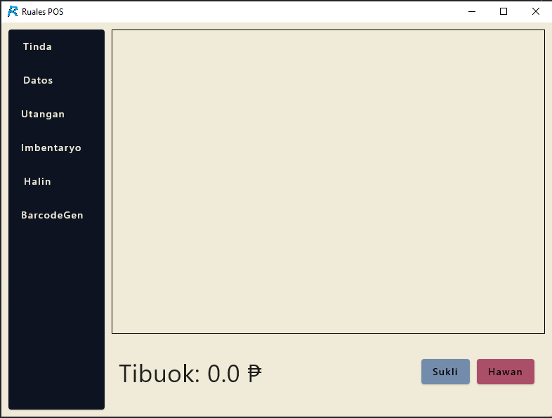
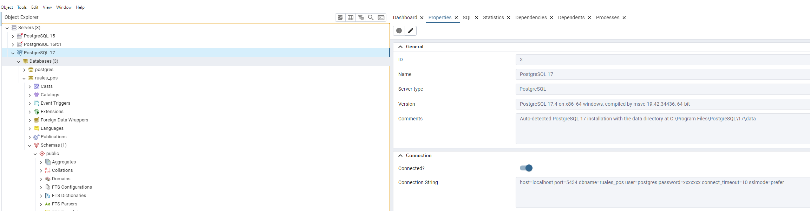

## Intro
This repository is the source code for the `Ruales POS` app, a pos system made for use in a *tindahan*.

Preview:

## Installation
### Windows
1. Download one of the [installers](https://github.com/gandor999/sanjose_barcode_scanner_4/releases)
2. If this is not the first time installing skip 3, 4, 6, and 8
2. Download [postgres](https://www.enterprisedb.com/downloads/postgres-postgresql-downloads)
3. Download the [driver](https://www.hsprinter.com/?m=common&a=down&name=61a71b56ce46d.zip&g=e) for the mini receipt printer
4. Run the installer for the pos app, and take note of the path of the installation
5. Create a postgres database and table, and make sure to name the table `Item` and the let the columns be `id (bigint not null), name (name), price (double precision not null)`
6. Go to the path of the installed pos app, find the `.env` file, edit the database connection string with your databse name i.e. `jdbc:postgresql://localhost:5434/sample_database_name` and fill in the user and password for the database. You can usually find this info in pg admin 
7. Extract the downloaded driver zip file, there will be two archived files, double click on the one that has `POS58`, run the installer
8. The app should be ready to go, create a desktop shortcut for convenience

### Uninstalling
1. Delete the pos app folder, it will most likely be found in `C:\Program Files (x86)\Ruales POS`

## Updating
1. Only do steps 1, 5, and 7 in the `Installation` section of this document for updating your version of the app, this is important since you will want to keep your data in the database as is

## Development
### Cloning the repository
1. Download and install git
2. Run the git cli and type in `git clone https://github.com/gandor999/sanjose_barcode_scanner_4.git`
3. If the cloning fails I may have to add you as a contributor to the project, reach out through my email `geodorruales@gmail.com` or `gandor999@gmail.com`

### Running the app
1. Use intellij ide, open the project and click on the `Run` icon on the top right and make sure to select the `desktop` one for running
2. You can also run the app by typing in `./gradlew run`

### Building the app
1. Type in `./gradlew shadowJar`
2. Go to `./build/libs`. The jar will be located here

## Things to do:

 - [x] Make the design for the interface first
 - [x] Let interface design just be one square for items and one square for total, clear, and print reciept
 - [x] Make area for items
 - [x] Make the item to count into map instead
 - [x] Lift up itemsToCount state
 - [x] Make area for totals
 - [x] Simulate on barcode scan
 - [x] Have a prototype scan for the scanner to scan the barcode and update the ui
 - [x] Make database for Item class
 - [x] Make .env file to store database metadata
 - [x] let the database be postgres
 - [x] add id to Item class
 - [x] Add a column for these items in scan
 - [x] Make a button to go to another page to set the database items
 - [x] Implement sensilyo dialog to calculate change
 - [x] Implement delete, update
 - [x] Fix ilis bug
 - [x] Change sensilyo with sukli
 - [x] Implement a new navigation bar on the left side
 - [x] Refactor the whole passing of states thing to just one object, its such a hassle to keep on maintaining more than one parameter for each function
 - [x] Improve exception handling
 - [x] Implement get
 - [x] Implement recibo button
 - [ ] Implement utang page
 - [ ] Implement inventory page
 - [ ] Implement halin page
 - [x] Implement ug barcode generator page
 - [x] Refactor page navigation
 - [ ] make keyboard shortcuts to make things alot faster
 - [x] Pag himo ug installation ani na app
 - [x] Make Item model
 - [x] Make a totals row
 - [x] Make an items row
 - [x] Make a clear all row
 - [x] Let Item model be something that can be removed
 - [x] Integrate actual connection of barcode scanner and map info to Item class
 - [x] Make a print receipt button
 - [ ] Continue with refactoring of suspend functions for coroutines
 - [x] Make barcode gen more pretty
 - [x] Test out on printer
 - [x] Test printer on print button
 - [x] Move resibo to skukli button
 - [x] finish implementing working resibo for tinda and barcode gen page
 - [ ] Put a check wherein resibo can only be clicked once total is greater than 0 and sukli has been calculated